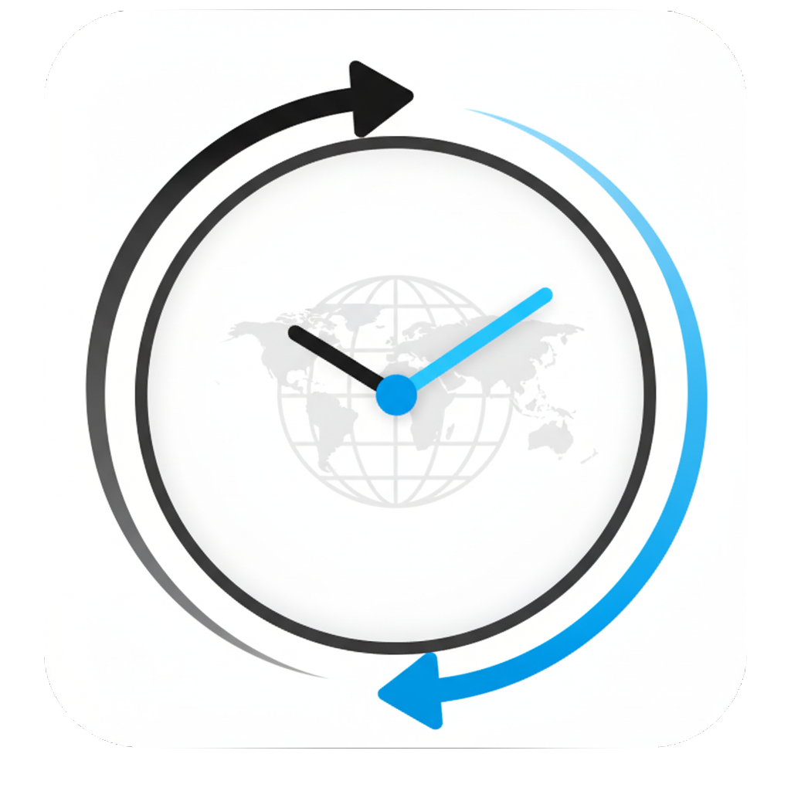
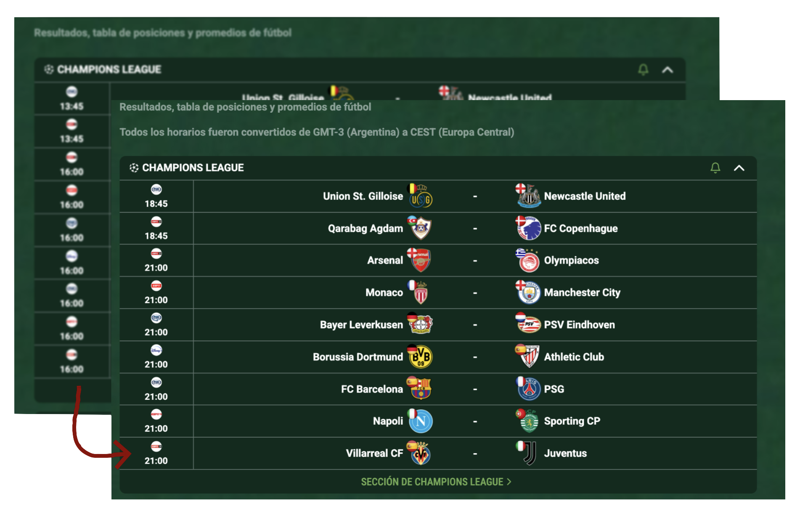

<h2 align="center">
  Promiedos Time Converter 🕚
</h2>

## Table of Contents

- [Description](#description)
- [Motivation](#motivation)
- [Built with](#built-with)
- [Preview](#preview)
- [To-do](#to-do)

## Description

Changes the time from GMT-3 to CEST in the Promiedos.com.ar website for Argentinians living abroad.

## Motivation

Honestly, I was tired of just trying to quickly check the day's football schedule while I was busy or thinking about something else. I'd see the kick-off time, then realize I had to do the math to figure out what time the game was actually playing where I live. This should be a native feature of the site! I even reached out to them to see if they could implement it since it can't be that hard. But despite checking out other websites for daily results and fixtures, I always end up coming back to Promiedos.com.ar.

## Built with

- [JavaScript](https://developer.mozilla.org/en-US/docs/Web/JavaScript)

## Preview

## To-do

- [ ] Global Time Zone Support: The extension will expand beyond the current GMT-3 to CEST conversion.
- [ ] Automatic Time Recognition: Detection of your local time to automatically convert the time.
